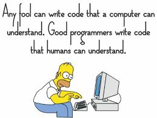

# MY README TEMPLATE

> Used Programming languages/Libraries

> To create more badges like the upper ones go to - https://shields.io

Elements in beautiful READMEs include, but are not limited to: images, screenshots, GIFs, text formatting, etc.

## Examples

- [myRepos/cv_camera](https://github.com/Saikat2019/cv_camera) - How to use camera in *ROS*

## Articles

- [ROS Tutorial](http://wiki.ros.org/ROS/Tutorials) - A good source to get startes - *Offocial ROS Tutorials*

## Tools

- [Common Readme Template](https://github.com/Saikat2019/MY_README_TEMPLATE/blob/master/README.md) - A common readme template I use.
- 

## Get Feedback

 -	### Give me feed back here.
	 - [My Email](#email) 
	 - [My Facebook ID](https://www.facebook.com/profile.php?id=100011440244328) - *feel free to ping*
 -  ### Me
 	

		
	

## Contribute

Contributions are always welcome!
Please *create an issue if you find one* first.

## License

>License of the Project goes here.
